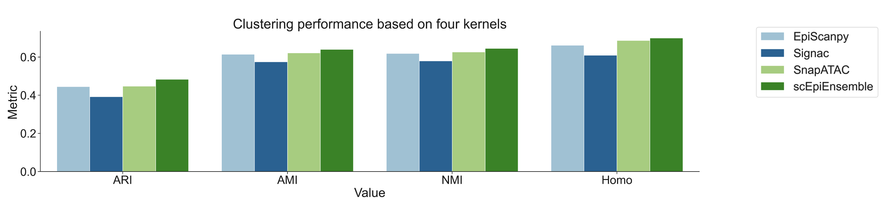

# scEpiEnsemble
scEpiEnsemble, an ensemble method that leverages the strengths of EpiScanpy, Signac, and SnapATAC, to obtain comprehensive insights into single-cell epigenomic data analysis. Users can perform online analysis of single-cell chromatin accessibility sequencing (scCAS) data using scEpiEnsemble through the analysis page of scEpitools (http://health.tsinghua.edu.cn/scepitools/analysis_page_scepiensemble.php).

    
## Requiements:  
1. Python 3.8 and R 4.2.0
2. Packages:  
    numpy (>=1.15.1)
    scanpy (1.9.1)
    louvain (0.8.0)
    EpiScanpy (0.3.2)
    Signac (1.9.0)
    SnapATAC (1.0.0)

## Tutorial   
We provide a step-by-step tutorial in the form of a notebook on the analysis page of scEpiTools. This tutorial is based on PBMC dataset. The example data consist in about 3000 cells of human PBMCs. Cells were FAC sorted thus providing a ground truth for cell type identification. The data was produces by [Buenrostro et al. 2018](http://health.tsinghua.edu.cn/scepitools/analysis_page_scepiensemble.php).
The data can be downloaded from [here](https://www.dropbox.com/s/cwlaaxl70t27tb2/data_tutorial_buenrostro.tar.gz?dl=0).

We computed four metrics, namely, adjusted rand index (ARI), adjusted mutual information (AMI), normalized mutual information (NMI), and homogeneity (Homo), to quantify the consistency between the clustering labels and the true cell type labels based on the dimensionality reduction result of the four methods. The performance of scEpiEnsemble was shown in the following Figure.

   

The performance of four methods was shown in the following table.

   
    
|  Method   | ARI  | AMI | NMI | Homo |
|  :----:  | :----: | :----: | :----: | :----: |
| scEpiEnsemble  | **0.483** | **0.641** | **0.645** | **0.699** |
|  EpiScanpy | 0.445 | 0.615 | 0.619 | 0.662 |
|  Signac | 0.392 | 0.575 | 0.580 | 0.609 |
|  SnapATAC | 0.448 | 0.622 | 0.627 | 0.687 |

  

You can implement the result using the source code from scEpiEnsemble_pipeline_html.ipynb.

## About 

If you are interested in the scEpiTools and want to contribute any articles or tools to our database, please [contact us](http://health.tsinghua.edu.cn/scepitools/about.php).

If you use scEpiTools in your work, please kindly cite our work: 

> scEpiTools: a database to comprehensively interrogate analytic tools for single-cell epigenomic data
